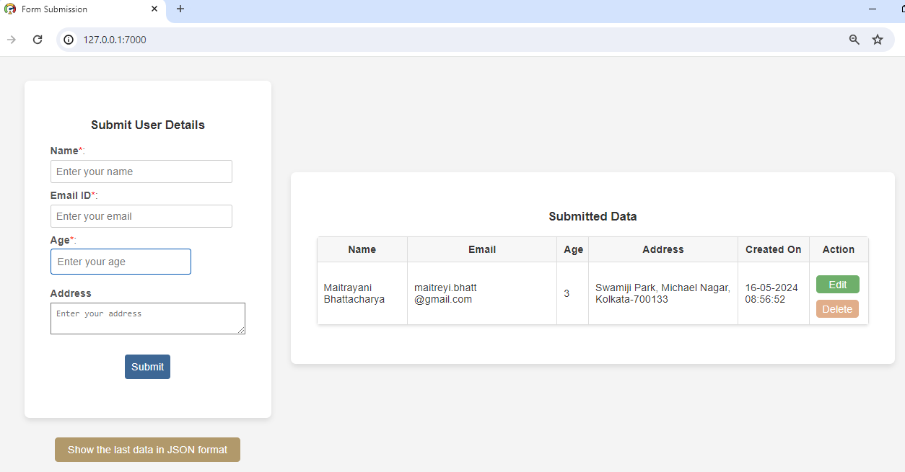
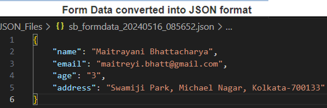
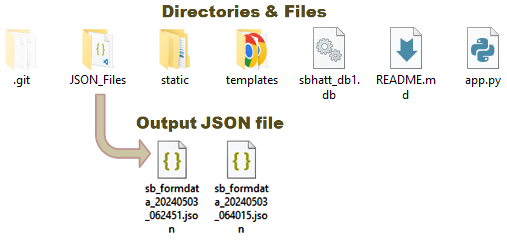

## Flask Application to Submit the Form Data to SQLite Database
> A simple Flask application that submits form data to an SQLite3 database and simultaneously generates a JSON file containing the same data.

## The Steps:

### i. Install necessary PIP packages (Flask and sqlite3).

+  `pip install flask`  
+  `pip install flask sqlite3`  

#### ii. Write the Python Code to develop the Web Application

#### iii. Run the Server in Localhost.
+  `>python app.py`  

     

#### ii. Form Submission
> The Name, Email ID and Age fields are required or mandatory. For the address field, the text area can be expanded in case more information needs to be written. 

   

#### iii. Display the Data in JSON Format
   

#### iv. Generate a JSON file (rename with current date and time) containing the same Form Data.
   

#### v. Connect the Database (SQLite3).
   

#### vi. Insert the submitted Form Data to the Database table.
   

